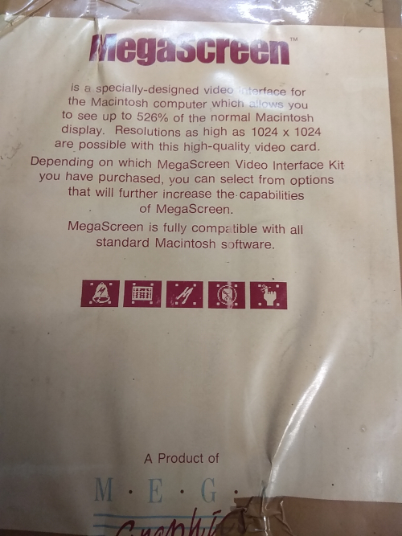
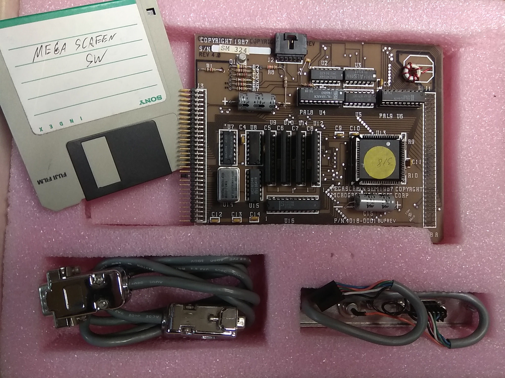

# MegaScreen documentation for the 21st century

If you've come wandering over to here wondering about that glorified
resistor between the power rails of your vintage Macintosh SE
computer, you've come to the right place.

Once upon a time, compact Macintosh computers had a vivid marketplace
as competitive, moderately high-end graphics workstations.  The
MegaScreen was one of many offerings to provide accelerated graphics
capabilities on a large, high resolution external monitor.  Believe it
or not, the MegaScreen use to have actual monetary value, and
significant companies purchased it quantity to support their internal
operations.

So why is it so hard to find technical information on it today?
Apparently it's not a great card for "collector value," so to speak,
so there is an unusual dearth of information on the card out on the
Internet.

## MegaScreen models

All models of MegaScreen listed here:

* Have 128 kilobytes of onboard VRAM

* Supported NTSC video output

* Supported expanding with a 68881 FPU math coprocessor

* All use the same (or compatible) TI Graphics System Processor chip

* And, therefore, are all compatible with the same software drivers

These are the different models currently known:

* MegaScreen Plus: Original model, designed for the Macintosh Plus.
  Came with cooling fan upgrade.

* MegaScreen II: Like MegaScreen Plus but uses a processor clip for
  easiesr installation.  Added support for the Macintosh 512Ke.

* MegaScreen SE: Code-named MegaScreen 3 on PCB, this was the first
  MegaScreen designed for the Macintosh SE.

* MegaScreen SE*M: Like MegaScreen SE but instead of having a
  solder-in socket for the FPU math coprocessor option, it defines a
  60-pin connector and shrinks the board to allow for plugging in
  arbitrary expansion boards.

## System Compatibility

* Host machine hardware: Macintosh SE, PDS slot required.  Not
  compatible with SE/30 PDS slot.

* OS: Anything newer than "System Software 2.0" (Macintosh System file
  version >= 4.0) is claimed to work.  System 6 is tested to work.  I
  don't know if System 7 is compatible.

## Getting started with the drivers

The first thing you need to know is that unlike other video expansion
cards of the time, the MegaScreen cards do not have any ROM chips on
board.  The Macintosh drivers are fully responsible for loading the
necessary firmware.  So, no software drivers, no MegaScreen.

Fortunately, we were able to capture a disk image of the drivers/tools
floppy from what looks like new-old-stock MegaScreen SE*M card.

The floppy disk image is in DiskCopy 4.2 format, compressed in a
StuffIt Expander archive.

[MegaMac10.sit](MegaMac10.sit)

Now that you've got that on, when you boot your Macintosh, you should
see a MegaScreen Manager startup window of a sort.  Here's where the
firmware loading magic happens.  Also, apparently the MegaScreen SE
hardware has some simple and cheap logic to see if a monitor is
actually connected, and if it's not, it will adapt to limit you to the
regular Macintosh desktop.

Note that the original version of the software drivers, MegaBoot, did
not support using both the Macintosh internal screen and the
MegaScreen at the same time.  For this reason, you probably don't want
a copy of it except for extreme nostalgia, and besides, this
repository doesn't have a copy of the original drivers either.

## Connecting your external monitor

So how do connect your MegaScreen to a modern monitor?  Or... at least
a VGA computer monitor?

Back in the days when the MegaScreen products were commercially sold,
they came with an external interface board that plugged into the
MegaScreen.  This was apparently a rather large board with several
video connector options that inhibited the portability of your
Macintosh.

When I contacted [Brian Girvin, former VP of Engineering for
MegaGraphics](https://www.linkedin.com/in/briangirvin/), he had the
info following to offer:

> I arrived at MegaGraphics in 1989 after Megascreen 3 and Gary Landis
> so I don't have info on that particular board.  However, from what I
> can tell from the photo (and my vague memories), the output is
> probably TTL and not VGA.  I don't see a DAC chip that would output
> VGA-type 1Vpp RGB signals.  Also I think VGA was limited to low
> resolutions in the late 1980's and didn't support 19" monitors.  I
> know MegaGraphics also had ECL monitors as well, so maybe this board
> outputs ECL signals.  The TI chip in the corner is the display
> controller.
>
> ...
>
> Unfortunately, I was not able to gather any information from the
> original MegaGraphics folks.  The original monitors were TTL or ECL,
> but they didn't really remember.  Good luck with documenting the
> early computer graphics history!  I wish I had more info.

Well, in any case, take a look at the back panel of your Macintosh SE.
You should see some PDS output connectors that look something like
this.  Mine is mounted upside-down, but whatever.

Here, you have a 50 ohm BNC connector for composite video output, and
a DE-9 female connector for for "component video" output.

To connect composite video and get the highest possible resolution,
you should use an S-Video plug on the monitor end.  Most modern
televisions and composite video input devices have filtering
electronics that limit the bandwidth on regular composite video to be
less than that of S-Video.

This is the pinout of the DE-9 connector:

1. VID
2. Video Shield
3. HSYNC
4. VSYNC
6. GND

All other pins are unconnected.  You can use a rather simple circuit
that looks something like this.

WARNING: If the bottom leg resistor ever becomes disconnected (like on
a breadboard), it is _possible_ that the circuit on the monitor end
could be exposed to 5 volts!  However, this would only ever happen in
the event that the opposite end does not use proper termination at the
characteristic impedance of 75 ohms, so you can argue that this is an
unlikely risk.

HSYNC and VSYNC should be wired straight up to the VGA connector
without termination.  Generally speaking, using termination on 5 volt
lines would consume an unreasonable amount of power.

Also note that if you don't have a 75 ohm resistor on-hand, a 100 ohm
resistor can be substituted as well.

**Pro-tip:** By using inverting buffers, a similar circuit can be
built to break out the internal Macintosh display signals to an
external VGA monitor.

Note that cheaper variations of this circuit design have been tested
and shown to work reasonably well in practice:

* You can eschew the buffers entirely because because the MegaScreen
  is capable of driving enough current to support the VGA connection.

* Alternateively, instead of using buffers, you can use diodes.  The
  purpose: If you want a white screen instead of a green screen, you'd
  be soldering red, green, and blue together.  However, that would
  invalidate the transmitter end's termination of the lines because
  signal reflections would be able to travel freely to the bridged
  lines.  Hence the use of diodes to sort of prevent this.

* Since transmit only travels in one direction, when the monitor end
  is properly terminated, the sole purpose of the terminator on the
  transmitter end is to prevent reflections of noise signals that
  might spontaneously emerge on the line.

* How much power/current can the MegaScreen source or sink?  The line
  driver chips run at 5 volts and, according to their datasheets, they
  can supply a maximum of 1 mA or 5 mA current.  I'd have to look at
  the board in more detail, but experimental measurements indicated a
  output impedance on the VID signal of approximately 5 kilo-ohms,
  which is consistent with the datasheet current limits.

  So... even though you don't have to worry about sending too much
  voltage to your VGA interface, you might have to worry about
  stressing the MegaScreen's line drivers too much.  I really don't
  know, but being on the safe side would mean adding more resistance
  at the expense of VGA signal strength.

Now, here's the deal with TTL vs. ECL.  Take a look at the logic chips
on the board, I have a chip inventory with datasheets for your
reference.  These all look to be 5V TTL logic chips, there isn't
anything to provide ECL drivers.  So, we definitely know that this is
TTL video output.  However, due to the discussion of interfacing with
VGA, it is fairly trivial to take a TTL video output and adapt it to
be compatible with ECL video.

## Additional software utilities

PLEASE NOTE: I have yet to find a copy of these tools.

* MegaZoom: Copy the Macintosh internal monitor to the MegaScreen
* MegaMail: Appletalk electronic mail program

## Hardware info

### Silkscreen text messages

P/N 4016-0001  
MICROGRAPHIC IMGES COPYRIGHT 1987  
MEGASCREEN 3  
DESIGNED BY GARY LANDIS  
16E3N00490  
COPROCESSOR OPTION  
BUFREMA  
FACE DOWN|

### Chip inventory, MegaScreen SE

Here is an itemized inventory of the chips on the MegaScreen SE
graphics card.  I'm transcribing full text from the chips in the
photographs in the event that the lot numbers might be useful, '\n'
denotes a newline.

* U1: MC74F245N \n (M) I 8629F
* U2: (MMI) PAL16L8ACN \n 8749 \n PAL 9
* U3: SN74ALS09N \n (M) 8307
* U4: (S) 74F74N \n FEH0737 \n 8809VB
* U5: MC74F00N \n (M) I8649J
* U6: (MMI) PAL16R4ACN \n 8823 \n PAL8TI
* U7: 74F191 PC \n 0026 
* U8: MC74F00N \n (M) I8649J
* U9: CRYSTAL OSCILLATOR \n M1200-70MHz \n MF ELECTRONICS CORP \n 08111 0188
* U10: MALAYSIA  423CF \n (TI) SN74LS365AN
* U11: Not connected
* U12: (M) MC74F08N \n XXAD8812
* U13: (TI) TMS34061FNL \n 8041011 \n LU8903
* U14: (TI) TMS4461-12NL \n HHP 8813 1139S \n SINGAPORE
* U15: (TI) TMS4461-12NL \n HHP 8813 1139S \n SINGAPORE
* U16: (TI) TMS4461-12NL \n HHP 8813 1139S \n SINGAPORE
* U17: (TI) TMS4461-12NL \n HHP 8813 1139S \n SINGAPORE
* U18: (S) 74F299N \n AAD4193 \n 8741VA
* U19: (S) 74F299N \n ACJ4720 \n 8805VB
* U20: Not connected, coprocessor option

Datasheets, 7400 series:

* MC74F00N: Quad 2-Input NAND Gate Fast Schottky TTL  
  Visited 2021-03-17: http://pdf.datasheetcatalog.com/datasheet/motorola/MC54.pdf
* MC74F08N: Quad 2-Input And Gate Fast Schottky TTL  
  Visited 2021-03-17: http://pdf.datasheetcatalog.com/datasheet/motorola/MC54F08.pdf
* SN74ALS09N: Quad 2-input Positive And Gates with Open-Collector Outputs  
  Visited 2021-03-17: https://www.ti.com/lit/ds/symlink/sn74als09.pdf?HQS=dis-dk-null-digikeymode-dsf-pf-null-wwe&ts=1616036024428
* 74F74N: Dual Positive Edge-Triggered Flip-Flop  
  Visited 2021-03-17: https://www.ti.com/lit/ds/symlink/sn74f74.pdf?ts=1616035930796  
  N.B.: Manufacturer does not match Signetics.
* 74F299N: 8-bit universal shift/storage register (3-state)  
  Visited 2021-03-17: http://pdf.datasheetcatalog.com/datasheet/motorola/MC74F299DW.pdf  
  N.B.: Manufacturer does not match Signetics.
* 74F191PC: Up/down binary counter with reset and ripple clock  
  Visited 2021-03-17: https://media.digikey.com/pdf/Data%20Sheets/Fairchild%20PDFs/74F191,Rev.April07.pdf
* MC74F245N: Octal Bidirectional Bus Transceiver With 3-State Inputs/Outputs  
  Visited 2021-03-17: http://pdf.datasheetcatalog.com/datasheet/motorola/MC74F245N.pdf
* SN74LS365AN: Non-inverting hex bus drivers with 3-state outputs  
  Visited 2021-03-17: https://www.ti.com/lit/ds/symlink/sn74ls365a.pdf?HQS=dis-dk-null-digikeymode-dsf-pf-null-wwe&ts=1616035371704

Datasheets, Texas Instruments graphics chips:

* TMS34061FNL: Graphics System Processor (nearest datasheet match)  
  Visited 2021-03-17: https://4donline.ihs.com/images/VipMasterIC/IC/TXII/TXIIS146289/TXIIS146289-1.pdf?hkey=FB3F1F3F2A09A989A6BF9D772C3B8264
* TMS4461-12NL: Fast Page Dual-Port Video DRAM, 64Kx4, 120ns, NMOS, PDIP24  
  Visited 2021-03-17: https://4donline.ihs.com/images/VipMasterIC/IC/TXII/TXIID099/TXIID099-4-27.pdf?hkey=FB3F1F3F2A09A989A6BF9D772C3B8264

Passives:

* 19x 100nF (?) bypass capacitors
* 1x 100uF (?) electrolytic bypass capacitor
* R1 R2 R3 R7 R8 R9 1K +/- 5% resistors
* R4 200 +/- 5% resistor
* R5 430 +/- 5% resistor
* R6 160 +/- 5% resistor
* Small ferrite bead
* Capacitor connected to small ferrite bead, unknown value
* **Large** heavy iron ring, off-board, on back-panel connector

### Chip inventory, MegaScreen SE*M

Work in progress!

The chip inventory of the MegaScreen SE*M is largely the same as that
of the MegaScreen SE, but some glue logic chip-saving simplifications
were performed.

* U2: MC74F04N
* U3: SN74ALS09N
* PAL8 U4: PAL16R4ACN
* U5: MC74F??N
* PAL9 U6: PAL16L8ACN
* U7: SN74LS365AN
* U8: ???
* U9: VRAM, probably same type
* U10: VRAM, probably same type
* U11: VRAM, probably same type
* U12: VRAM, probably same type
* U13: Graphics System Processor, probably same type
* U14: CRYSTAL OSCILLATOR \n M1200-70MHz \n MF ELECTRONICS CORP \n ???
* U15: MC74F04N
* U16: (S) 74F576N (???)

### Back-panel connector

When installed, it looks like this from the inside of the Macintosh
computer:

The colored wires in the PDS connector terminate on the MegaScreen
board in this order:

1. Black
2. White
3. Red
4. Green
5. Orange (or Brown)
6. Blue

The pinout of the DE-9 connector was noted previously.  The BNC video
connector is wired with black (ground) and orange (signal).

Many of these lines are wired in series with one of the resistors
onboard.

## Company history

Initially, the name of the company behind the MegaScreen was
Micrographic Images.  They were later renamed to MegaGraphics.

## More information

Here are some links to magazines with more info.

West Coast Report column p.33 of the Sept. 86 Issue PDF.

https://vintageapple.org/macuser/pdf/MacUser_8609_September_1986.pdf

Check out the display reviews in these magazines:

Page 146:

https://vintageapple.org/macworld/pdf/MacWorld_8905_May_1989.pdf
