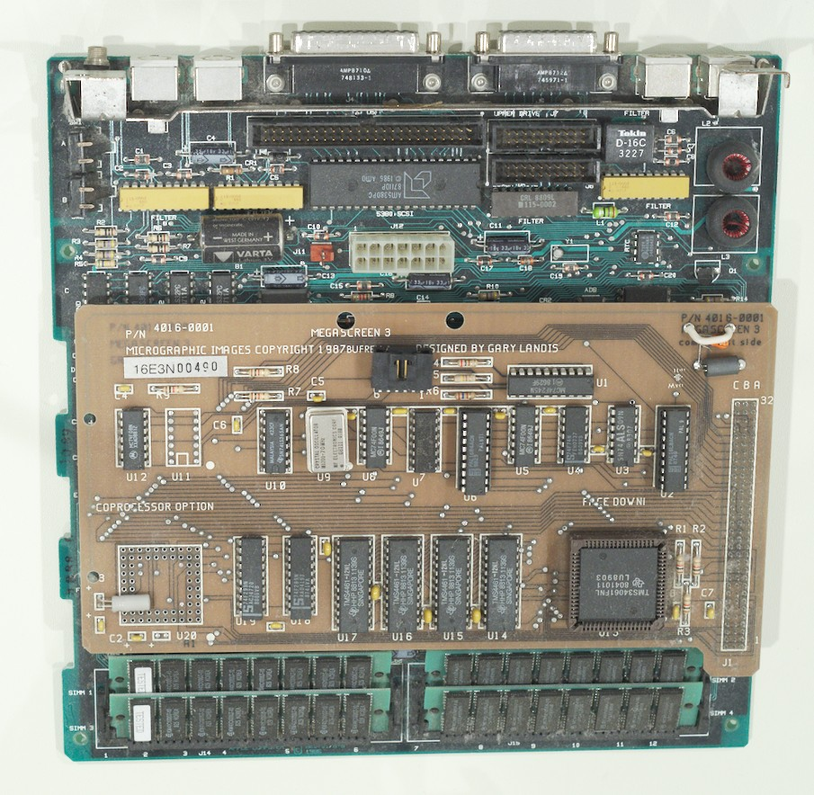
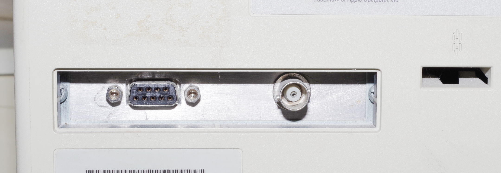
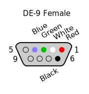
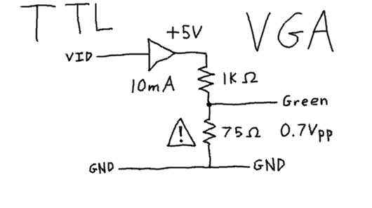
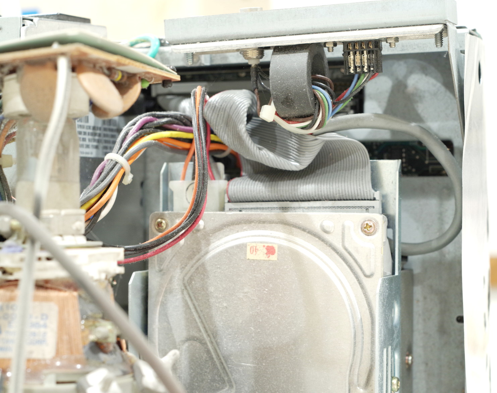

# Megascreen documentation for the 21st century

If you've come wandering over to here wondering about that glorified
resistor between the power rails of your vintage Macintosh SE
computer, you've come to the right place.

Once upon a time, compact Macintosh computers had a vivid marketplace
as competitive, moderately high-end graphics workstations.  The
Megascreen was one of many offerings to provide accelerated graphics
capabilities on a large, high resolution external monitor.  Believe it
or not, the Megascreen use to have actual monetary value, and
significant companies purchased it quantity to support their internal
operations.

So why is it so hard to find technical information on it today?
Apparently it's not a great card for "collector value," so to speak,
so there is an unusual dearth of information on the card out on the
Internet.

## Getting started with the drivers

The first thing you need to know is that unlike other video expansion
cards of the time, the Megascreen cards do not have any ROM chips on
board.  The Macintosh drivers are fully responsible for loading the
necessary firmware.  So, no software drivers, no Megascreen.

I have yet to get my hands on a disk image of the original drivers
floppy disk.  Until then, you can find a Megascreen 3 system file
copied off of an installed hard drive here:

[MegaScreen.Bin](MegaScreen.Bin)

It's MacBinary, so if you use ZTerm and ZMODEM to copy it over to your
vintage Macintosh, it should unpack just fine and be all ready to go.

Now that you've got that on, when you boot your Macintosh, you should
see a Megascreen Manager startup window of a sort.  Here's where the
firmware loading magic happens.  Also, apparently the Megascreen 3
hardware has some simple and cheap logic to see if a monitor is
actually connected, and if it's not, it will adapt to limit you to the
regular Macintosh desktop.

## Connecting your external monitor

So how do connect your Megascreen to a modern monitor?  Or... at least
a VGA computer monitor?

When I contacted [Brian Girvin, former VP of Engineering for
MegaGraphics](https://www.linkedin.com/in/briangirvin/), he had the
info following to offer:

> I arrived at MegaGraphics in 1989 after Megascreen 3 and Gary Landis
> so I don't have info on that particular board.  However, from what I
> can tell from the photo (and my vague memories), the output is
> probably TTL and not VGA.  I don't see a DAC chip that would output
> VGA-type 1Vpp RGB signals.  Also I think VGA was limited to low
> resolutions in the late 1980's and didn't support 19" monitors.  I
> know MegaGraphics also had ECL monitors as well, so maybe this board
> outputs ECL signals.  The TI chip in the corner is the display
> controller.
>
> ...
>
> Unfortunately, I was not able to gather any information from the
> original MegaGraphics folks.  The original monitors were TTL or ECL,
> but they didn't really remember.  Good luck with documenting the
> early computer graphics history!  I wish I had more info.

Well, in any case, take a look at the back panel of your Macintosh SE.
You should see some PDS output connectors that look something like
this.  Mine might be mounted upside-down, but whatever.

Here, you have a 50 ohm BNC connector for composite video output, and
a DE-9 female connector for for "component video" output.  I am not
fully certain of the pinout, but an educated guess leads me to this
hypothesis.

1. +5V
2. VID
3. HSYNC
4. VSYNC
6. GND

All other pins are unconnected.  You can use a rather simple circuit
that looks something like this.  PLEASE NOTE: This circuit has not
been tested!

WARNING: If the bottom leg resistor ever becomes disconnected, it is
_possible_ that the circuit on the monitor end could be exposed to 5
volts!  However, this would only ever happen in the event that the
opposite end does not use proper termination at the characteristic
impedance of 75 ohms, so you can argue that this is an unlikely risk.

Also note that if you don't have a 75 ohm resistor on-hand, a 100 ohm
resistor can be substituted as well.

**Pro-tip:** By using inverting buffers, a similar circuit can be
built to break out the internal Macintosh display signals to an
external VGA monitor.

## Additional software utilities

PLEASE NOTE: I have yet to find a copy of these tools.

* MegaZoom: Copy the Macintosh internal monitor to the MegaScreen
* MegaMail: Appletalk electronic mail program

## Hardware info

### Silkscreen text messages

P/N 4016-0001  
MICROGRAPHIC IMGES COPYRIGHT 1987  
MEGASCREEN 3  
DESIGNED BY GARY LANDIS  
16E3N00490  
COPROCESSOR OPTION  
BUFREMA  
FACE DOWN|

### Chip inventory

Here is an itemized inventory of the chips on the Megascreen 3
graphics card.  I'm transcribing full text from the chips in the
photographs in the event that the lot numbers might be useful, '\n'
denotes a newline.

* U1: MC74F245N \n (M) I 8629F
* U2: (MMI) PAL16L8ACN \n 8749 \n PAL 9
* U3: SN74ALS09N \n (M) 8307
* U4: (S) 74F74N \n FEH0737 \n 8809VB
* U5: MC74F00N \n (M) I8649J
* U6: (MMI) PAL16R4ACN \n 8823 \n PAL8TI
* U7: 74F191 PC \n 0026 
* U8: MC74F00N \n (M) I8649J
* U9: CRYSTAL OSCILLATOR \n M1200-70MHz \n MF ELECTRONICS CORP \n 08111 0188
* U10: MALAYSIA  423CF \n (TI) SN74LS365AN
* U11: Not connected
* U12: (M) MC74F08N \n XXAD8812
* U13: (TI) TMS34061FNL \n 8041011 \n LU8903
* U14: (TI) TMS4461-12NL \n HHP 8813 1139S \n SINGAPORE
* U15: (TI) TMS4461-12NL \n HHP 8813 1139S \n SINGAPORE
* U16: (TI) TMS4461-12NL \n HHP 8813 1139S \n SINGAPORE
* U17: (TI) TMS4461-12NL \n HHP 8813 1139S \n SINGAPORE
* U18: (S) 74F299N \n AAD4193 \n 8741VA
* U19: (S) 74F299N \n ACJ4720 \n 8805VB
* U20: Not connected, coprocessor option

Datasheets, 7400 series:

* MC74F00N: Quad 2-Input NAND Gate Fast Schottky TTL  
  Visited 2021-03-17: https://pdf1.alldatasheet.com/datasheet-pdf/view/3991/MOTOROLA/MC74F00N/+2J82uplRMROLDdRHDCMYvZ+/datasheet.pdf
* MC74F08N: Quad 2-Input And Gate Fast Schottky TTL  
  Visited 2021-03-17: http://pdf.datasheetcatalog.com/datasheet/motorola/MC54F08.pdf
* SN74ALS09N: Quad 2-input Positive And Gates with Open-Collector Outputs  
  Visited 2021-03-17: https://www.ti.com/lit/ds/symlink/sn74als09.pdf?HQS=dis-dk-null-digikeymode-dsf-pf-null-wwe&ts=1616036024428
* 74F74N: Dual Positive Edge-Triggered Flip-Flop  
  Visited 2021-03-17: https://www.ti.com/lit/ds/symlink/sn74f74.pdf?ts=1616035930796
* 74F299N: 8-bit universal shift/storage register (3-state)  
  Visited 2021-03-17: https://pdf1.alldatasheet.com/datasheet-pdf/view/15414/PHILIPS/N74F299N/+04425UL.hKpRudSwzLzHpZ+/datasheet.pdf
* 74F191PC: Up/down binary counter with reset and ripple clock  
  Visited 2021-03-17: https://media.digikey.com/pdf/Data%20Sheets/Fairchild%20PDFs/74F191,Rev.April07.pdf
* MC74F245N: Octal Bidirectional Bus Transceiver With 3-State Inputs/Outputs  
  Visited 2021-03-17: https://pdf1.alldatasheet.com/datasheet-pdf/view/168623/MOTOROLA/MC74F245N/+0WJ745VKMyOyRx.eyI.DODGHb+/datasheet.pdf
* SN74LS365AN: Non-inverting hex bus drivers with 3-state outputs  
  Visited 2021-03-17: https://www.ti.com/lit/ds/symlink/sn74ls365a.pdf?HQS=dis-dk-null-digikeymode-dsf-pf-null-wwe&ts=1616035371704

Datasheets, Texas Instruments graphics chips:

* TMS34061FNL: Graphics System Processor (nearest datasheet match)  
  Visited 2021-03-17: https://pdf1.alldatasheet.com/datasheet-pdf/view/83006/TI/TMS34010-60/+531QJUPGZyMTBN-BBhEY+/datasheet.pdf
* TMS4461-12NL: Fast Page Dual-Port Video DRAM, 64Kx4, 120ns, NMOS, PDIP24  
  Visited 2021-03-17: https://4donline.ihs.com/images/VipMasterIC/IC/TXII/TXIID099/TXIID099-4-27.pdf?hkey=FB3F1F3F2A09A989A6BF9D772C3B8264

Passives:

* 19x 100nF (?) bypass capacitors
* 1x 100uF (?) electrolytic bypass capacitor
* R1 R2 R3 R7 R8 R9 1K +/- 5% resistors
* R4 200 +/- 5% resistor
* R5 430 +/- 5% resistor
* R6 160 +/- 5% resistor
* Small ferrite bead
* Capacitor connected to small ferrite bead, unknown value
* **Large** heavy iron ring, off-board, on back-panel connector

### Back-panel connector

When installed, it looks like this from the inside of the Macintosh
computer:

## More information

Here are some links to magazines with more info.

West Coast Report column p.33 of the Sept. 86 Issue PDF.

https://vintageapple.org/macuser/pdf/MacUser_8609_September_1986.pdf

Check out the display reviews in these magazines:

Page 146:

https://vintageapple.org/macworld/pdf/MacWorld_8905_May_1989.pdf
